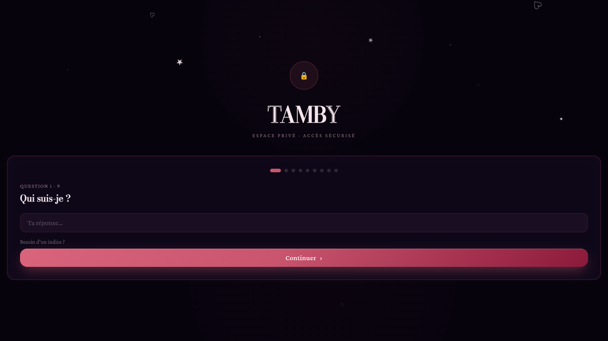
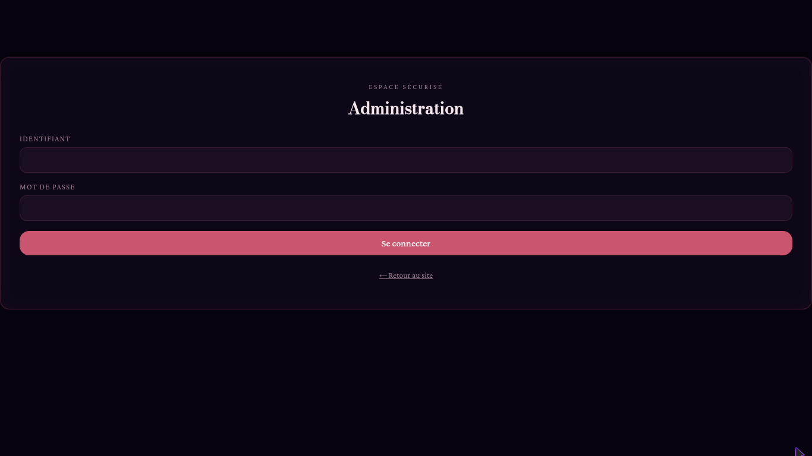
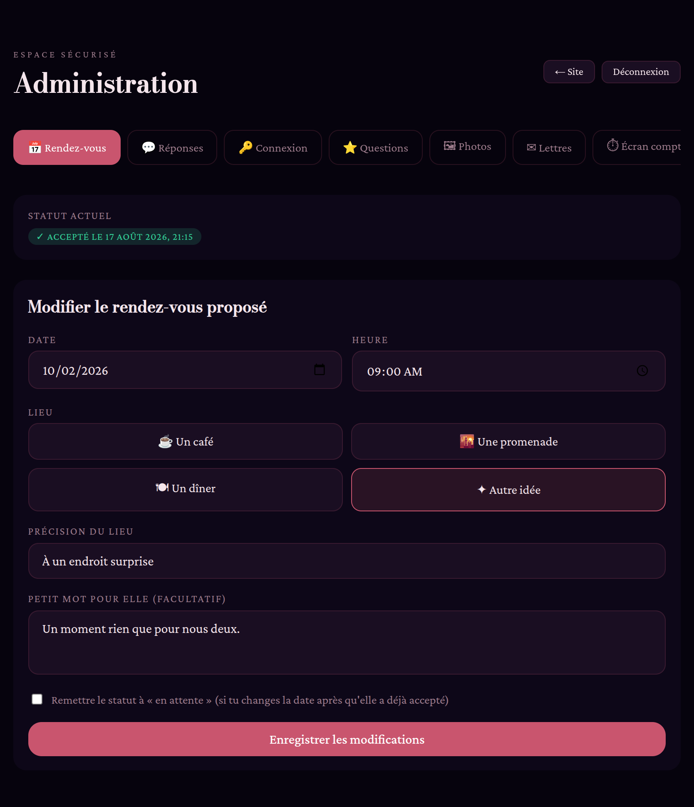

# Tamby — Expérience d'anniversaire (PWA — HTML / CSS / JS / PHP / MySQL)

Application web progressive (PWA) racontant une expérience d'anniversaire personnalisée,
avec un **rendez-vous déjà défini** (que tu peux modifier à tout moment depuis l'admin) et
connecté à une base de données MySQL, plus un panneau d'administration pour consulter les
réponses et gérer ce rendez-vous. Interface entièrement responsive, sans aucun défilement
horizontal sur mobile.

## 🗂 Structure du projet

```
/
├── index.php              → page principale (toutes les étapes de l'expérience)
├── manifest.json          → manifeste PWA
├── sw.js                  → service worker (mode hors-ligne / installable)
├── css/style.css          → tout le design (couleurs, polices, animations)
├── js/app.js               → logique front-end (navigation entre écrans, appels API)
├── icons/                 → icônes de l'app (192px, 512px, maskable)
├── admin/
│   ├── index.php          → connexion + tableau de bord admin
│   └── app.js
├── api/                   → backend PHP (endpoints JSON)
│   ├── config.php         → ⚠️ identifiants MySQL à renseigner ici
│   ├── get_content.php
│   ├── verify_auth.php
│   ├── complete_auth.php
│   ├── save_answers.php
│   ├── respond_appointment.php     ← Tamby accepte le rendez-vous proposé
│   ├── admin_login.php / admin_logout.php
│   ├── admin_change_password.php   ← changer le mot de passe admin
│   ├── admin_data.php
│   ├── admin_content.php           ← CRUD questions / catégories / photos / lettres / réponses
│   ├── admin_save_settings.php     ← réglages de l'écran « Notre histoire » (compteur)
│   ├── admin_upload_photo.php      ← téléversement direct d'une image
│   ├── admin_set_appointment.php   ← toi seul modifies date / heure / lieu / mot
│   ├── logout.php                  ← déconnexion du visiteur (Tamby)
│   └── setup_admin.php    ← à lancer UNE FOIS puis à supprimer
├── uploads/photos/        → images téléversées depuis l'admin (protégé, voir plus bas)
└── sql/
    ├── schema.sql         → structure de la base + contenu par défaut (installation neuve)
    └── migration_v2.sql   → à lancer UNE FOIS si ta base existait déjà avant cette mise à jour
```

## 🚀 Installation

1. **Base de données**
   - Crée une base MySQL (ou laisse le script la créer) et importe `sql/schema.sql` :
     ```bash
     mysql -u root -p < sql/schema.sql
     ```
   - ⚠️ Si tu avais **déjà** installé une version précédente du site, importe plutôt
     `sql/migration_v2.sql` (une seule fois) pour ajouter les catégories dynamiques et les
     réglages de l'écran compteur sans perdre tes données existantes.

2. **Connexion à la base**
   - Ouvre `api/config.php` et renseigne tes identifiants :
     ```php
     const DB_HOST = 'localhost';
     const DB_NAME = 'tamby_experience';
     const DB_USER = 'ton_utilisateur';
     const DB_PASS = 'ton_mot_de_passe';
     ```

3. **Dépose les fichiers sur ton hébergement PHP** (le projet ne nécessite aucune dépendance
   externe — juste PHP 8+ avec l'extension PDO MySQL activée).

4. **Crée ton compte admin**
   - Ouvre `https://tondomaine.com/api/setup_admin.php` dans le navigateur.
   - Choisis un identifiant et un mot de passe (min. 8 caractères).
   - **Supprime ensuite ce fichier** (`api/setup_admin.php`) du serveur — il ne doit servir
     qu'une seule fois pour des raisons de sécurité.

5. **C'est prêt !** Ouvre `index.php`. Sur mobile, un bandeau « Ajouter à l'écran d'accueil »
   permettra d'installer le site comme une vraie application (PWA).

6. **Dossier d'upload des photos**
   - Vérifie que `uploads/photos/` existe et est accessible en écriture par PHP :
     ```bash
     mkdir -p uploads/photos && chmod 775 uploads/photos
     ```
   - Un fichier `.htaccess` protège déjà ce dossier sous Apache (empêche toute exécution de
     script qui s'y trouverait). Si tu héberges sous **Nginx**, ajoute dans ta config serveur :
     ```nginx
     location ^~ /uploads/ {
         location ~ \.php$ { deny all; }
     }
     ```
   - Quoi qu'il en soit, l'endpoint d'upload ne peut techniquement **jamais** produire de
     fichier `.php` : le nom et l'extension du fichier enregistré sont entièrement générés par
     le serveur à partir du type d'image réellement détecté (jamais depuis le nom envoyé par
     le navigateur), et chaque image est revérifiée avec `getimagesize()` avant écriture.

## 💌 Personnaliser le contenu

Tout le contenu (questions de sécurité, questions, lettres, photos, écran « Notre histoire »)
est stocké dans la base de données et se gère entièrement depuis `/admin` :

- **🔑 Connexion** : les questions de sécurité posées à l'écran de connexion (question, réponse
  attendue, indice, ordre) — création, modification, suppression.
- **⭐ Questions** : les questions sincères (texte, catégorie, ordre) — création, modification,
  suppression. Un petit gestionnaire de **catégories** en haut de l'onglet permet d'ajouter ou
  de supprimer des catégories à la volée (ex : ajouter « Souvenirs » en plus de Musique /
  Émotions / Nous). Une catégorie encore utilisée par une question ne peut pas être supprimée
  — réattribue d'abord les questions concernées.
- **🖼 Photos** : deux façons d'ajouter une image, au choix :
  1. **Téléverser un fichier** directement depuis ton ordinateur ou ton téléphone (bouton
     dédié) — l'image est enregistrée dans `uploads/photos/` et son chemin renseigné
     automatiquement.
  2. **Indiquer un chemin ou une URL** à la main dans le champ texte (utile si tu préfères
     héberger tes images ailleurs).
  Légende, texte alternatif, ordre et suppression sont bien sûr éditables.
- **✉ Lettres** : titre, contenu, date/mention, ordre — création, modification, suppression.
- **⏱ Écran compteur** : configure entièrement l'écran « Notre histoire » que Tamby voit avant
  les questions — date/heure de votre première conversation, textes (titre, sous-titre, note,
  citation, libellé du jour), et les 4 libellés du compte à rebours (Jours/Heures/Minutes/
  Secondes). Tout est modifiable sans toucher au code.
- **💬 Réponses** : consulte les réponses de Tamby, et supprime-les si besoin — une confirmation
  est toujours demandée avant suppression définitive (action irréversible).

Alternative : tu peux aussi modifier directement les tables (`auth_questions`, `site_questions`,
`question_categories`, `letters`, `photos`, `site_settings`) avec ton client MySQL préféré
(phpMyAdmin, Adminer, etc.), mais l'admin reste la façon la plus simple et sûre de faire.

## 📅 Rendez-vous (déjà défini, modifiable depuis l'admin)

Le rendez-vous n'est plus proposé par Tamby : **c'est toi qui le définis** à l'avance.

1. Dans `/admin` → onglet **📅 Rendez-vous**, choisis la date, l'heure, le lieu
   (café / promenade / dîner / autre) et un petit mot facultatif, puis *Enregistrer*.
2. Sur le site, l'écran final affiche cette proposition sous une jolie carte récapitulative
   (date, heure, lieu, mot) — Tamby n'a plus qu'à cliquer **« Oui, avec plaisir »** pour
   l'accepter.
3. Sa réponse est enregistrée automatiquement ; le statut (*En attente* / *Accepté*) est
   visible en un coup d'œil dans l'admin.
4. Si tu changes la date **après** qu'elle a déjà accepté, coche la case « Remettre le statut
   à en attente » avant d'enregistrer, pour qu'elle puisse re-confirmer le nouveau créneau.

Toutes les données du rendez-vous vivent dans une seule ligne de la table
`scheduled_appointment` (id = 1) : pas de multiples demandes à trier, une seule vérité.

## 🔐 Accès admin

- URL : `/admin/`
- Se connecte avec l'identifiant/mot de passe créés via `setup_admin.php`.
- Le petit bouton invisible en bas à droite du site (ou le raccourci clavier : taper
  "admin" au clavier) redirige aussi vers `/admin/`.
- Un bouton **Déconnexion** est disponible en haut du tableau de bord admin.
- L'onglet **🔒 Compte** du tableau de bord permet de changer ton mot de passe à tout moment
  (il faut saisir le mot de passe actuel, puis le nouveau, deux fois).

## 🚪 Déconnexion visiteur (Tamby)

Une fois connectée, Tamby voit un petit bouton **« ⎋ Déconnexion »** en haut à droite de l'écran
(masqué uniquement sur l'écran de connexion). Il permet de fermer sa session en cours — un
rechargement de page ramène alors directement à l'écran des questions de sécurité, comme lors
de la toute première visite.

## ♪ Note sur les questions

L'encart « musique suggérée » (titre + artiste affiché au-dessus d'une question) a été retiré
de l'écran des 9 questions, comme demandé. Les questions restent classées par catégorie
(❤ Émotions · ♪ Musique · ✦ Nous) mais sans suggestion de chanson imposée.

## ✨ Boutons d'ouverture améliorés

Les deux tout premiers boutons du parcours ont été retravaillés avec un style plus premium
(dégradé, lueur, légère élévation au survol, flèche animée) :
- **« Continuer »** sur l'écran de connexion (auth)
- **« Commence l'aventure »** sur l'écran de bienvenue

Classe CSS : `.btn-lux` (voir `css/style.css`), appliquée en plus de `.btn-primary` /
`.btn-ghost` existants — le reste des boutons garde son style d'origine.

## 📱 Mobile — zéro défilement horizontal

Le CSS a été renforcé pour garantir qu'aucune page ne déborde latéralement, y compris sur
les très petits écrans (dès 320px) :
- `overflow-x: hidden` sur `html` et `body`, largeur contrainte à `100vw`.
- Tous les textes longs (lettres, questions, notes de rendez-vous) passent en retour à la
  ligne forcé (`overflow-wrap: break-word`).
- En dessous de 420px, les grilles à deux colonnes (champs date/heure, choix du lieu)
  s'empilent automatiquement en une seule colonne.
- La barre d'onglets de l'admin reste défilable horizontalement **par choix** (comportement
  mobile standard pour une liste d'onglets), mais ce défilement est contenu dans son propre
  conteneur et ne fait jamais défiler la page entière.

## 🎨 Écran de confirmation du rendez-vous

L'écran affiché après que Tamby a cliqué « Oui, avec plaisir » a été retravaillé pour éviter
le texte plat en blanc uni : le titre utilise maintenant le même effet de dégradé chatoyant
(`.text-shimmer`) que le reste du site, et le récapitulatif du rendez-vous est mis en valeur
dans un encart à bordure lumineuse (`.glow-border`) avec la couleur d'accent du site, au lieu
d'être une simple phrase en texte clair.

## 📲 PWA (Progressive Web App)

Le site est installable comme une vraie application, sur mobile comme sur ordinateur :
- `manifest.json` déclare le nom, les icônes (192/512/maskable) et le thème de l'app.
- `sw.js` (service worker) met en cache l'app shell pour un chargement instantané et un
  fonctionnement hors-ligne partiel ; les appels `/api/` et `/admin/` ne sont jamais mis en
  cache (données toujours fraîches).
- Des balises `apple-mobile-web-app-*` ont été ajoutées dans `index.php` pour une meilleure
  installation depuis Safari iOS (« Sur l'écran d'accueil »).
- Sur Chrome/Edge Android et desktop, un bandeau ou une icône d'installation apparaît
  automatiquement dans la barre d'adresse une fois le site servi en HTTPS.

⚠️ Le service worker et l'installation PWA nécessitent **HTTPS** (ou `localhost` en test) —
c'est une exigence du navigateur, pas une limite du projet.




